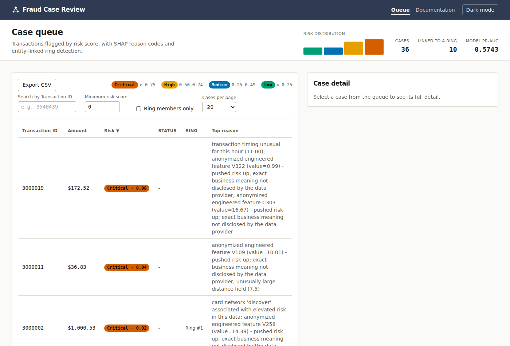
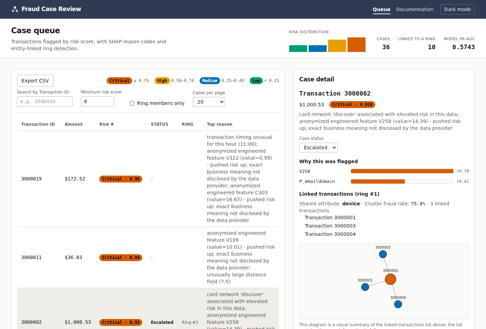

# AML Fraud Detection

A two-part portfolio project: an end-to-end fraud detection and fraud-ring
identification ML pipeline, and a case-review web application that serves
its output. Built on the
[IEEE-CIS Fraud Detection](https://www.kaggle.com/competitions/ieee-fraud-detection)
Kaggle dataset (Vesta Corporation's real, anonymized e-commerce transaction
data).



**This is a portfolio and research project on public competition data, not
a production AML system.** See each sub-project's README for the specific
disclaimer.

## Structure

```
AMLFraud-Detection/
├── ieee-fraud-network/    the ML pipeline
└── fraud-review-app/      the review application
```

The two are deliberately decoupled: the pipeline scores transactions and
exports flat files; the app reads those files and serves them through a
JSON API. Neither depends on the other's internals, only on the three-file
export contract between them, which mirrors how a real fraud-ops system
actually runs (scoring as a batch job, a review tool serving that job's
output).

## [`ieee-fraud-network`](ieee-fraud-network) — the pipeline

Six stages: time-based data loading, a LightGBM classifier, SHAP-based
reason codes, an entity-link graph for fraud-ring detection, a formal
backtest report, and an export step.

Real results on the full 590,540-transaction dataset:

- **PR-AUC 0.5743** — recall@10% budget = 75.2% (7.9x random-order baseline),
  recall@1% budget = 26.1% (22.6x random-order baseline)
- **1,254 candidate fraud rings** found via entity-link graph, covering
  22,783 transactions, at a 36.3% fraud rate (10.4x the dataset baseline)

Full detail, methodology, and the two real bugs caught and fixed during
development (a LightGBM early-stopping metric conflict, an entity-graph
mega-cluster problem) are in
[`ieee-fraud-network/README.md`](ieee-fraud-network/README.md).

## [`fraud-review-app`](fraud-review-app) — the review application

A FastAPI backend and a vanilla HTML/CSS/JS frontend (Tailwind via CDN, D3
for the one interactive diagram) reading the pipeline's exported output. A
sortable, searchable, paginated case queue; SHAP reason codes and
force-directed ring diagrams per case; a review-budget simulator; case
status tracking; CSV export; shareable case links; dark mode.



Setup instructions, the full API reference, and the file contract are in
[`fraud-review-app/README.md`](fraud-review-app/README.md). The app also
has its own in-app documentation page once it's running
(`/docs.html`).

## Quick start

```bash
# 1. Set up the environment
conda create -n AMLFraud-Detection python=3.11 -y
conda activate AMLFraud-Detection

# 2. Run the pipeline (see ieee-fraud-network/README.md for the full sequence
#    and for getting train_transaction.csv / train_identity.csv from Kaggle
#    into ieee-fraud-network/data/raw/ first)
cd ieee-fraud-network
python -m data.loader
python -m models.baseline
python -m explainability.shap_report
python -m network.entity_graph
python -m evals.backtest
python -m export.to_app

# 3. Run the app against real pipeline output
cd ../fraud-review-app
mkdir -p data/real
cp ../ieee-fraud-network/export/output/*.csv ../ieee-fraud-network/export/output/*.json data/real/
pip install fastapi uvicorn "pydantic>=2"
DATA_DIR=data/real uvicorn backend.main:app --reload
```

Or skip straight to step 3 with `DATA_DIR` unset. The app ships with
bundled synthetic sample data and runs standalone without the pipeline.

## Tech stack

Python (pandas, LightGBM, SHAP, networkx) for the pipeline; FastAPI and
pytest for the app's backend; hand-written HTML/CSS/JS with Tailwind (CDN)
and D3 for the frontend, no build tooling anywhere in either half.