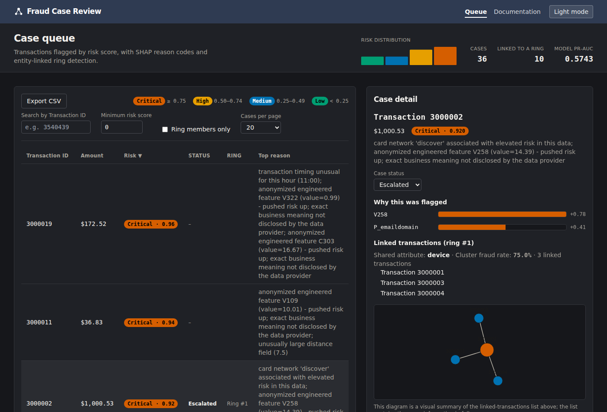
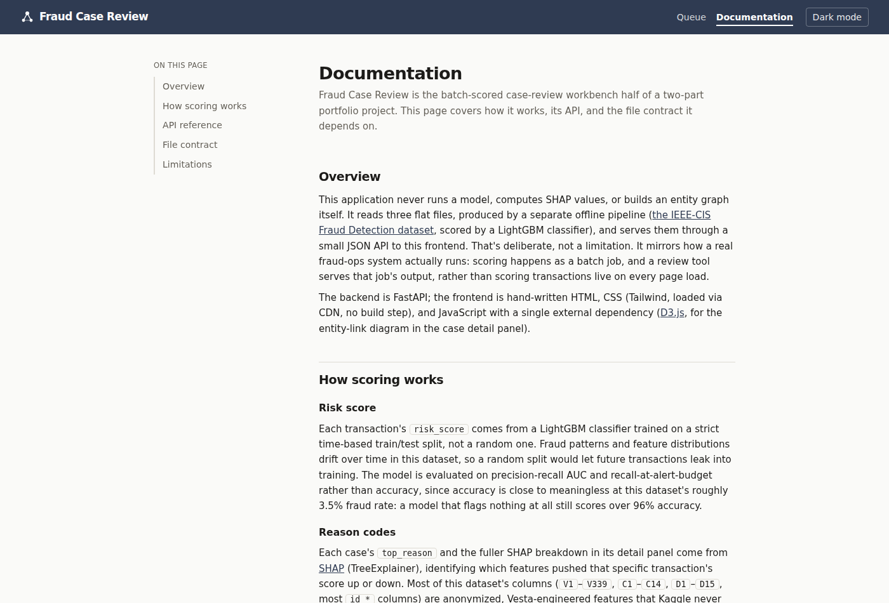

# Fraud Case Review

A batch-scored fraud case-review workbench: a FastAPI backend serving a JSON
API, plus a static HTML/CSS/JS frontend with no build step. This is the
`fraud-review-app` half of the `AMLFraud-Detection` monorepo. The other
half, [`ieee-fraud-network`](../ieee-fraud-network), is the ML pipeline that
produces the data this app reads.


## What this is (and isn't)

This app never runs a model, computes SHAP values, or builds an entity graph
itself. It reads three flat files, produced by the pipeline, and serves
them through a small JSON API. That's deliberate, not a limitation. It
mirrors how a real fraud-ops system actually runs: scoring happens as
a batch job, and a review tool serves that job's output, rather than scoring
transactions live on every page load.

It's a portfolio/research project on public competition data, not a
production AML system. See the [Limitations](#limitations) section, and the
in-app [Documentation page](#documentation-page) for the full detail.

## Features

- **Case queue** — sortable (click any column header), searchable by
  Transaction ID, filterable by minimum risk score and ring membership,
  server-side paginated
- **Case detail panel** — SHAP-based plain-language reason codes, a
  proportional bar chart of contributing features, and (for transactions
  linked to a candidate fraud ring) a force-directed network diagram of the
  ring plus the full linked-transaction list
- **Case status tracking** — mark a case Reviewed, Escalated, or Dismissed;
  reflected immediately in both the detail panel and the queue
- **Review budget simulator** — "if a team can only review N% of cases,
  what fraction of fraud gets caught by risk order vs. random order?" —
  falls back to a clearly-labeled proxy metric when ground truth isn't
  available (see [`docs.html`](#documentation-page))
- **CSV export** — download the currently filtered queue, not just the
  visible page
- **Shareable case links** — selecting a case updates the URL
  (`#case=3540439`); opening that URL elsewhere auto-selects the same case
- **Risk distribution chart** — a small bar chart of case counts by risk
  tier, next to the summary stats
- **Dark mode** — toggle in the nav, persists across both pages via
  `localStorage`, applied before first paint (no flash of the wrong theme)




## Running it

```bash
conda activate AMLFraud-Detection   # or your environment of choice
pip install fastapi uvicorn "pydantic>=2"
uvicorn backend.main:app --reload
```

Open `http://127.0.0.1:8000/`. By default this reads the bundled synthetic
sample data in `data/sample/` (36 cases, 3 candidate rings), enough to
exercise every feature without needing the real pipeline output.

### Pointing it at real pipeline output

Copy the exported files from `ieee-fraud-network`, then point `DATA_DIR` at
them:

```bash
# from ieee-fraud-network/
mkdir -p ../fraud-review-app/data/real
cp export/output/*.csv export/output/*.json ../fraud-review-app/data/real/

# from fraud-review-app/
DATA_DIR=data/real uvicorn backend.main:app --reload
```

`GET /api/summary` should then report the real case count (5,906 in the
reference run) rather than the sample's 36.

## Documentation page

Once the app is running, `http://127.0.0.1:8000/docs.html` has the full
in-app documentation: how scoring/SHAP/ring-detection work, complete API
reference with example request/response pairs for every endpoint, the exact
file-contract schemas, and the limitations section. This README covers the
same ground at a higher level, aimed at someone setting the project up
rather than using it.



## API overview

All endpoints are JSON (except the CSV export). Full reference with example
responses is in [`docs.html`](#documentation-page) once the app is running;
this is the quick-reference version.

| Endpoint | Notes |
|---|---|
| `GET /api/cases` | Paginated, filtered, sorted case list. Params: `min_risk_score`, `cluster_only`, `search`, `sort_by`, `sort_dir`, `limit`, `offset` |
| `GET /api/cases/export` | CSV of the currently filtered set (same filter params, no pagination) |
| `GET /api/cases/{transaction_id}` | Full case detail: SHAP breakdown, cluster info if ring-linked |
| `PUT /api/cases/{transaction_id}/status` | Body: `{"status": "reviewed" \| "escalated" \| "dismissed" \| null}` |
| `GET /api/budget-simulation` | Param: `budget_pct`. Recall (or proxy metric) at that review budget |
| `GET /api/summary` | Headline counts + model PR-AUC |
| `GET /api/risk-distribution` | Case counts bucketed into the same 4 risk tiers used for badges |

## File contract

The backend reads from a data directory (`DATA_DIR`, default
`data/sample/`):

| File | Required? | Schema |
|---|---|---|
| `scored_transactions.csv` | **Yes** — app fails loudly at startup if missing | `TransactionID, TransactionAmt, risk_score, top_reason, cluster_id` (nullable) |
| `shap_detail.csv` | No — degrades gracefully | `TransactionID, feature_name, shap_value, feature_value` (long format) |
| `entity_clusters.csv` | No — degrades gracefully | `cluster_id, TransactionID, shared_attribute, cluster_fraud_rate` |
| `metadata.json` | No — `pr_auc` omitted if missing | `{"pr_auc": 0.5743, ...}` |

Missing optional files mean the corresponding feature (explanations, ring
diagrams, PR-AUC in the summary) is unavailable, not that the app crashes.

## Project structure

```
fraud-review-app/
├── backend/
│   ├── main.py          # FastAPI app, all routes
│   ├── data.py          # File loading + in-memory case-status store
│   ├── models.py        # Pydantic response models
│   └── tests/
│       └── test_api.py  # pytest + TestClient, dependency-injected test data
├── frontend/
│   ├── index.html        # Case queue
│   ├── docs.html         # In-app documentation
│   ├── app.js            # All frontend logic, no framework
│   └── favicon.svg
├── data/
│   ├── sample/            # Bundled synthetic demo data
│   └── real/               # Real pipeline output (not committed - see .gitignore)
├── screenshots/
├── pytest.ini
└── README.md
```

## Testing

```bash
pytest backend/tests/test_api.py -v
```

37 tests, using FastAPI's `TestClient` with `app.dependency_overrides` to
inject test data directly. No environment variables, no temp files, no
module reimporting are needed. Coverage includes: filtering/sorting/search/pagination
math, missing-optional-file graceful degradation, the loud failure on a
missing required file, case status set/clear/persistence, CSV export
respecting filters, and the ground-truth-vs-proxy fallback in the budget
simulator (tested with `isFraud` both present and absent, since the real
pipeline data never has it).

## Limitations

This is a portfolio and research project on public competition data
([IEEE-CIS Fraud Detection](https://www.kaggle.com/competitions/ieee-fraud-detection)),
not a production AML system:

- **Regulatory compliance** — a real Australian deployment would need
  AUSTRAC-compliant model documentation and formal model risk management,
  which this doesn't attempt.
- **Case-management workflow** — status tracking here is a single
  in-memory dict on the backend process (see `CaseStatusStore` in
  `backend/data.py`). It resets on server restart and isn't safe across
  multiple worker processes. A real deployment needs this backed by a
  database, plus audit trails, escalation paths, and SAR/TTR filing
  workflows this doesn't implement.
- **Candidate rings are leads, not verdicts** — cluster membership reflects
  unusual linkage and elevated fraud rate within the source pipeline's
  data, not confirmed coordinated fraud.
- **The budget simulator's proxy metric** — when ground truth isn't
  available (the normal case with real pipeline data), it substitutes
  candidate-ring membership as a directional stand-in for recall. The API
  response and the UI both say so explicitly wherever this applies; it's
  never silently presented as verified recall.